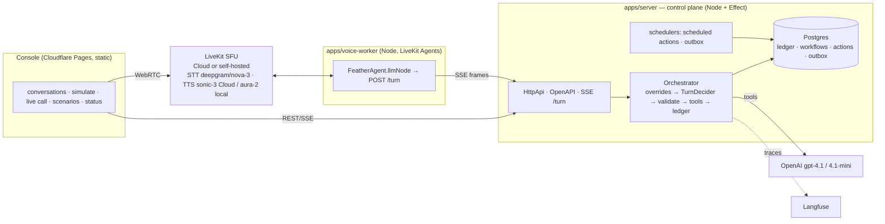

# Feather-Lite

A small **collections voice-agent platform** — the primitives a lender needs to run compliant
outbound calls at scale, not a chatbot with a phone number:

- a **deterministic state machine** that is the authority on what may happen on a call
  (right-party verification before any account data, tools legal only in specific states,
  compliance overrides that beat the model, promises recorded *before* they are confirmed aloud);
- an **LLM conversationalist** (GPT-4.1 / 4.1-mini per state) that only ever *suggests*
  transitions and tool calls — every suggestion is validated and, when illegal, rejected and logged;
- a **durable event ledger** in Postgres (monotonic `sequence_no` per conversation) that the
  transcript, the outcome, the replay view, scheduled follow-ups and post-call jobs are all
  derived from — so a JSON simulation, the scenario suite and a real LiveKit voice call
  produce identical events for identical inputs.

Built as an interview artifact for a Backend + AI Engineer role at a lending voice-agent company;
the PRD (`PRD.md`) and implementation spec (`SPEC.md`) are the requirements, this repository is v2:
**TypeScript + Effect** end to end (control plane, LiveKit Agents worker, browser console). A Python
v1 came first and was rewritten after the review in `docs/reviews/`; it is gone from the tree (ADR
0005 records why TypeScript won) and lives on only in git history.

## What is here (v2, verified 2026-08-28)

| Area | Status | Evidence |
|---|---|---|
| Pure domain (`packages/domain`): states, adjacency, overrides, tool matrix, event union, replay reducer, pre-call policy, scripts, percentiles | done | 210 unit tests |
| Control plane (`packages/control-plane`): Effect services, Postgres via `@effect/sql-pg`, three-phase turn, tools with idempotency, scheduled-action + outbox workers, scripted + OpenAI deciders, Langfuse tracing | done | 76 unit + 66 DB tests, incl. **20/20 scenarios** on real Postgres |
| HTTP API (`packages/contracts` + `apps/server`): Effect HttpApi, 25 routes, OpenAPI at `/docs`, SSE turn stream, bearer/rate-limit middleware with counted rejections | done | live smoke: start / turn(SSE) / replay / 409 / 422 / scenarios |
| Voice worker (`apps/voice-worker`): LiveKit Agents 1.6 `llmNode` → `/turn`, barge-in heard-text, interruptible read-back guard, AMD-gated SIP path, heartbeats | done (browser path) | automated real voice call on LiveKit Cloud with GPT-4.1; scripted voice call == simulation scenario (state path, tools, outcome) |
| Operator console (`apps/console`): conversations, transcript + timeline + replay, simulate (streaming), **call me in the browser**, scenario matrix, status/seed | done | headless run: 20/20 matrix, PTP simulation, browser call joined LiveKit Cloud with live transcript |
| Deployment on free tiers (Neon + Cloudflare Tunnel + Pages + LiveKit Build) | documented, needs your accounts | `docs/deploy/free-tier-live-demo.md` |
| **Self-hosted media plane**: LiveKit SFU in Docker (`pnpm lk:up`), Deepgram direct plugins (nova-3 STT + Aura TTS) behind `STT_TTS_PROVIDER` | done | headless voice call + browser call on the local SFU, both equivalence-green vs the simulation; ADR 0006 |
| **Load tested**: control plane to 200 concurrent conversations, voice fleet to 5 concurrent real calls (10 = CPU ceiling) | done | 200/200 correct outcomes at C=200, 5/5 equivalence-green at N=5 (2026-08-21). A 2026-08-27 re-measure got 3/5 on a loaded box while N=2 stayed clean — diagnosed as host starvation, not regression, and written up in `docs/loadtest/README.md` |
| **Audio-native end-of-turn**: the deprecated text EOU model and its 500 ms endpointing replaced by the auto-provisioned `inference.TurnDetector` (local, no LiveKit Cloud) at 300/2500 | done | tier-2 N=5: per-turn latency p50 2397 → 2145 ms; worker EOU delay ~780 → ~578 ms |
| **Prompt cache alignment**: static persona/RULES first, transcript next, volatile state/time/account last; static prefix sized past OpenAI's 1,024-token floor, `prompt_cache_key` per state | done | measured `cached_tokens` 1024 on the *next call's* first turn (cross-conversation prefix reuse) and 1792/1920 deep into a long call; latency-neutral at these prompt sizes — the win is cost (0.75× cached input) and early engagement (ADR 0008) |
| **Cross-call memory**: SUMMARY outbox job persists a ledger-derived `wrap_up`; one deterministic line per prior call (promises, dispute/hardship verbatim, borrower's last words) in the decider's HISTORY block | done | verified live: call N+1's prompt carries "promised 550.00 by …; their last words: …"; equivalence stays green; no migration, no second store, gated behind right-party verification |
| **Playout truth under TTS failure**: a TTS stream that stalls to zero audio is reported as unheard (`interrupted: true`), so the fully-heard guard repeats the read-back instead of accepting a confirmation of silence; Deepgram TTS websocket connect patched with a 4 s retryable timeout | done | reproduced live (53 s silent read-back recorded as "heard"), fixed, and re-verified across 8 instrumented runs + fleet N=5 (ADR 0008) |
| **Per-turn latency waterfall**: EOU delay → transcription → decide TTFT → TTS TTFB, persisted per turn, on the Langfuse span, and drawn in the console (per call and as fleet p50/p95) | done | measured on a local voice call: 578 / 470 / 23 / 420 ms, total p50 1495 ms |
| **Quality scores**: one ledger-side score model (`conversation_scores`) fed by the deterministic evaluator, an LLM judge, the voice harness and human labels, mirrored to Langfuse; `GET/POST /api/conversations/:id/scores` | done | 6 producers on one table; scores visible in Langfuse and on the console's Quality view; ADR 0009 |
| **LLM-as-judge**: GPT-5.6 Luna reads each finished call post-call in the outbox and returns a **binary pass/fail per dimension with a quoted piece of transcript evidence** (task completion, compliance, factual accuracy, empathy, escalation) | done, off by default (`JUDGE_ENABLED`) | live: a real call judged in one attempt, 6 scores with evidence quotes; unparseable output → `judge.invalid_output`, never silence; judge request body asserted to carry no account data (leak test) |
| **Judge-vs-human agreement**: pass/fail label control on the conversation page; agreement measured only over calls carrying both | done | live: labelling one call moved agreement from null to 100% over 1 labelled call |
| **Outcome funnel + SLO**: attempts → connected → right-party → promise-to-pay with each rate against the previous stage, promise ageing (PENDING/DUE_TODAY/OVERDUE in the borrower's own timezone), p95 vs target per latency component — one request, `GET /api/system/quality` | done | live: 6 attempts → 2 promises, SLO naming `ttft_ms` as its one breach; SPEC §17.2's right-party-verification and voicemail rates now present |
| **STT word error rate**, measured by the voice harness against the exact text it spoke, normalised explicitly (contractions, number words, currency, spoken digit runs) and **gated in the fleet run** (`--max-wer`, default 0.20 from measurement) | done — **harness only** | 23 normaliser table tests; measured 0.000 on all three scripted lines, worst single reading 0.111 under barge-in. A production call has no ground truth, so there is no production WER and the console says so |
| **TTS signal**: zero-audio playouts counted (excluding turns the borrower superseded before the agent replied — those look identical and are not failures), and characters-per-second flagged as an outlier beyond ±40% of the window's own median | done — **heuristic, not a quality score** | there is no MOS model here: UTMOS/NISQA are Python-only and were left unbuilt rather than faked. These answer "did any audio come out" and "was this turn spoken at a rate unlike the rest", and nothing about how the speech sounded (ADR 0009) |
| **Reliability**: provider error/retry/timeout counters per vendor with a last-error ring, the six failure counts ADR 0008 found, and an **orphaned-call sweeper** (worker liveness + LiveKit confirmation, ~35–40 s) | done | chaos script under `apps/voice-worker/src/tracer/`; a killed worker's call is finalized FAILED/ORPHANED and the borrower is callable again |
| **Shippable images**: multi-stage `node:22-bookworm-slim` Dockerfiles for both services, `pnpm deploy --prod` runtime trees, non-root, health checks, and an `app` compose profile | done (amd64 run, arm64 checked not built) | server **505 MB**, worker **724 MB**; both started and verified. arm64 promised only because the native packages publish `linux-arm64-gnu` |
| **Calls through the containerised stack** — Postgres, SFU, server and worker all in Docker, only the borrower harness on the host | done (measured on the simulated fleet) | N=5 **twice**, 5/5 equivalence both times, WER 0.000, zero silent playouts, **6.74-6.85 CPU-seconds per call-minute**. It needed the SFU to stop advertising `127.0.0.1` (`LIVEKIT_NODE_IP`) and the resource sampler to learn about the application containers — before that a `--profile app` run reported no worker resources at all |
| **Native VAD** (`inference.VAD`, the Silero model in the addon the EOU detector already uses) | done on Linux; **unusable on Windows** | `onnxruntime-node` and `@livekit/agents-plugin-silero` are out of the tree, the Dockerfile's 513 MB hand-prune is deleted, the worker image is 781 → **724 MB** and the idle worker tree 1 651 → **1 093 MB**. `eou_delay_ms` p95 unchanged (580 vs 582). On win32 the addon costs ~450 MB of non-reclaimable native memory **per process that predicts**, which killed every call of an N=5; on linux/x64 the same probe reads 37 MB. `pnpm --filter @feather-lite/voice-worker vad-cost` re-takes it |
| **Process metrics**: event-loop delay, RSS/heap, GC, pg-pool depth, per-loop liveness and CPU-seconds on `/api/system/status` and on `GET /metrics` in Prometheus format; `/readyz` fails when a background loop stops ticking | done | one snapshot serves both surfaces, so they cannot disagree; the server also profiles itself on demand (`PROFILE_SECONDS`) because `node --cpu-prof` cannot be used on Windows |
| **Trace redaction**: `TRACE_REDACT_ACCOUNT_DATA` (on by default) masks amounts, dates, delinquency counts and long digit runs in every exported span body — the turn span, the generation's prompt, the judge's transcript | done | installed on the span processor, not per call site; 19 domain + 6 boundary tests, including that latency metadata is never touched |
| **Per-core budget, measured**: control plane **~0.015 CPU-seconds per turn** (≈ 65-100 turns/s per core); voice worker **~10-12 CPU-seconds per call-minute**, **~300 MB per call**, **3.3-3.9 calls per vCPU** at N=5 | done | `docs/loadtest/README.md`, 2026-08-28 section. Twelve vCPU laptop (Ryzen 5 5600H); N=10 acceptance not yet run |
| **Efficiency pass**: 43.6 → **31.7 Postgres statements per completed turn**; worker idle tree 2 406 → **1 620 MB**; job-process cold start 2 659 → **1 834 ms**; outbox backlog drain **7× faster**; soak memory growth 46 → **26 MB/min** | done | every change measured either side with the same harness on the same box; `pg_stat_statements` in every load report |
| PSTN via SIP trunk, Oracle always-on VM, Effect 4 | **not done** | listed honestly in "Not built" below |

Progress by phase: `docs/plans/PROGRESS.md`. Decisions: `docs/adr/`. Review that led to v2:
`docs/reviews/2026-08-16-plan-vs-implementation-review.md`.

## Architecture



- **The control plane owns the loop** (ADR 0001). The worker is a media adapter: it sends the
  borrower's final text (and, after a barge-in, the *heard* part of the agent's last line) and
  speaks the frames it gets back (ADR 0002).
- **A turn is three phases** — claim (tx) → decide (no tx) → commit (tx) → speak (ADR 0003).
  Read-backs and "recorded" confirmations are only spoken after the commit.
- **Everything is a Layer.** `TurnDecider` is scripted in tests/CI and OpenAI in production;
  `Tracing` is Langfuse or noop; the `Clock` is frozen for scenario replays and shifted for
  seeded history — same orchestrator, no mocks.

### The turn frame protocol (`packages/contracts/src/turnFrames.ts`)

`turn_start{turn_id,state}` → `delta{text}`* → `say{text,allow_interruptions}`* →
`turn_end{new_state, agent_text, tool_called, call_control_action, outcome, end_call, degraded, ttft_ms}` | `error{code,message}`

Same stream for the console (`Simulate`) and the voice worker; `turn_id` idempotency and
`supersede` (barge-in) are handled server-side.

### Repository map

```
packages/domain/         pure: enums, ids, values, stateMachine, overrides, tools, events, replay, transcript, preCall, context, scripts, turn
packages/contracts/      HttpApi definition (18 routes) + SSE turn frames
packages/control-plane/  config, db (migrations, repos), services (Orchestrator, Workflow, Scheduling, Outbox, Scenarios, Seed, VoiceSessions, Tracing, VirtualClock), llm (LlmClient, prompts, OpenAITurnDecider), http (handlers, TurnRunner, app)
apps/server/             Node entry: API + in-process schedulers
apps/voice-worker/       LiveKit Agents worker (+ tracer/ harnesses: fake borrower, fleet, equivalence, lk-smoke, text-run)
apps/console/            Vite + TS operator console (no framework), deploys to Pages
apps/load-test/          tier-1 control-plane load harness (plain tsx)
deploy/livekit/          livekit-server config for the self-hosted compose profile
docs/adr/                0001–0007 · docs/deploy/ runbook · docs/loadtest/ results · docs/plans/ plan, revisions, findings, progress
```

## Run it locally

Prerequisites: Node 22, pnpm 11, Docker (for Postgres). Copy `.env.example` to `.env`.

```bash
pnpm install
pnpm db:up                       # Postgres 16 on localhost:5434
pnpm dev:server                  # API on http://127.0.0.1:8080  (migrations run on boot; /docs = OpenAPI)
curl -X POST http://127.0.0.1:8080/api/demo/seed
pnpm dev:console                 # console on http://127.0.0.1:5173 (proxies /api to 8080)
```

That is enough for **Conversations**, **Simulate** (streaming JSON path) and **Scenarios** with the
deterministic decider. For the real model set `TURN_DECIDER=openai` + `OPENAI_API_KEY` in `.env`
(and Langfuse keys if you want traces). For **Live call** add the LiveKit Cloud keys and start the
worker:

```bash
pnpm dev:worker                  # LiveKit Agents worker "feather-lite-agent" (heartbeats show on Status)
```

`pnpm dev` runs server + worker + console together.

### Running it the way it is measured

`dev` is `tsx` and, for the worker, LiveKit's development mode — where `loadThreshold` is `Infinity`
and the worker can never report itself full. Every number in `docs/loadtest/README.md` comes from
the other pair:

```bash
pnpm build                       # esbuild: one file per app
pnpm start:server                # node apps/server/dist/main.js
pnpm start:worker                # node apps/voice-worker/dist/agent.js start  (production mode)
pnpm stack:quiet                 # stop Langfuse, find stray workers, report free memory
```

`stack:quiet` exits non-zero under 3 GB free, which is the line a fleet run needs, **and on a stray
host voice worker** — the failure where the run looks fine and the numbers belong to a process
nobody is watching. `--allow-worker` is the escape when that worker is yours and deliberate. It will
not close your browser or run `wsl --shutdown` — both are yours — but it names them when they are
the problem.

**On Windows, WSL keeps the memory it has taken.** `vmmemWSL` has been seen holding 5.8 GB with every
container stopped. `wsl --shutdown` returns it, and `autoMemoryReclaim=gradual` under
`[experimental]` in `%USERPROFILE%\.wslconfig` stops it accumulating.

### As containers

```bash
docker compose --profile livekit --profile app up -d --build
```

Both images are `node:22-bookworm-slim`, non-root, health-checked, and built from the repo root so
the pnpm workspace is intact. `docker buildx build --platform linux/amd64,linux/arm64` works for
both — every native package the worker needs publishes a `linux-arm64-gnu` build — though only
amd64 has been run here. A container-to-container **call** needs the SFU's advertised node IP to be
reachable from the worker container: set `LIVEKIT_NODE_IP` to a host address both sides can reach
(the default `127.0.0.1` is for the browser demo and means "this container" to a containerised
worker). With that set, calls through the containerised worker are verified — see
`docs/loadtest/README.md`, 2026-09-01.

### Voice with no cloud account (self-hosted LiveKit)

The media server is a config value, not an architecture decision (ADR 0006). To run the whole stack
locally, start the SFU and point `.env` at it:

```bash
pnpm lk:up                       # livekit-server in Docker: ws://127.0.0.1:7880 (+ UDP 7882 mux, TCP 7881)
```

```
LIVEKIT_URL=ws://127.0.0.1:7880
LIVEKIT_API_KEY=devkey
LIVEKIT_API_SECRET=<deploy/livekit/livekit.yaml keys.devkey>
STT_TTS_PROVIDER=plugins         # LiveKit Inference is Cloud-only; use Deepgram directly (nova-3 STT + Aura TTS)
DEEPGRAM_API_KEY=...
```

Nothing else changes — the server, console and tracers work against either target. Going back to
Cloud is the same four lines in reverse. SIP/PSTN stays Cloud-only (no `livekit-sip` locally); the
worker fails such a call fast with a clear log line. Smoke the server with
`pnpm --filter @feather-lite/voice-worker lk-smoke`.

### Traces with no cloud account (self-hosted Langfuse)

```bash
pnpm lf:up                       # Langfuse 4 + its Postgres/ClickHouse/Redis/MinIO on http://127.0.0.1:3000
```

```
LANGFUSE_PUBLIC_KEY=pk-lf-feather-lite-local
LANGFUSE_SECRET_KEY=sk-lf-feather-lite-local
LANGFUSE_BASE_URL=http://127.0.0.1:3000
```

Those keys are created on first boot by the compose file's headless initialisation, so there is no
account to make and no UI to click through (sign in as `dev@feather-lite.local` / `feather-lite-local`
if you want to browse). `LANGFUSE_ENABLED=false` silences the exporter without removing the keys —
set it before a tier-1 load run, which would otherwise export a span per scripted turn.

### Tests

```bash
pnpm check                       # typecheck + unit tests (domain 94, control-plane 30)
pnpm test:db                     # 29 DB tests on Postgres: 20 scenarios, repos, concurrency, superseded transcript, workers, LLM leak
pnpm --filter @feather-lite/voice-worker text-run      # LiveKit text-mode harness against the fake control plane
pnpm --filter @feather-lite/voice-worker fake-borrower # automated real voice call + SPEC §10.5 equivalence assertion
pnpm loadtest:tier1 -- --concurrency 100 --ramp 2      # control-plane load: 100 concurrent conversations
pnpm loadtest:tier2 -- --calls 5                       # voice load: 5 concurrent real calls, each equivalence-checked
```

CI (`.github/workflows/ci.yml`) runs typecheck, unit tests and the DB suite against a Postgres
service container. Both load harnesses gate on **correctness** — every conversation's final ledger
must replay to the expected scripted outcome — and merely report latency. Measured numbers and the
saturation analysis are in **`docs/loadtest/README.md`**.

## Live, free, clickable demo

`docs/deploy/free-tier-live-demo.md` is the runbook: Neon (Postgres), Cloudflare Tunnel (API URL),
Cloudflare Pages (console), LiveKit Cloud Build (media), Deepgram + Cartesia (STT/TTS), optional
Langfuse — total $0 plus cents of OpenAI. `pnpm tunnel` and `pnpm deploy:console` are wired; the
console takes the API URL and bearer token from `?api=…#token=…`.

## Not built (deliberately listed)

- **PSTN dial-out** is wired (`createSipParticipant` + AMD → `amd_result` signal) but no SIP trunk
  was configured, so it is not verified end to end.
- **Always-on hosting** (Oracle Always Free VM) is documented, not exercised; the API is up while
  the Node processes run.
- **Horizontal scale** is untested. Load testing found the knee at ~70–95 turns/s on one Node
  process and showed Postgres was nowhere near saturated (raising the pool made it slower, and after
  the 2026-08-28 round-trip work the database accounts for under a second of a four-second run); a
  second server process behind one port with leader-elected schedulers is the obvious next lever,
  and it has not been run.
- **The N=10 voice acceptance run** the efficiency spec sets as its bar. N=5 is green twice over
  with the observability stack down, and the worker's admitted concurrency is a configured number
  (`WORKER_MAX_JOBS`) rather than a measured one. The per-vCPU figures in the table above come from
  N=5 and say so.
- **MOS-class TTS quality** (UTMOS/NISQA). Python-only; deliberately not approximated. What is
  measured instead is labelled a heuristic everywhere it appears — see ADR 0009.
- **Production word error rate.** There is no ground truth for a live call; WER is a harness metric
  and a fleet gate, and the console says so rather than showing an empty chart.
- **Promise-kept rate.** Needs payment ingestion. `record_payment` is named as the missing input
  rather than approximated from the promise date.
- Semantic (embedding) override safety net, Durable Objects/Queues, Effect 4 — stretch items from
  the plan.
