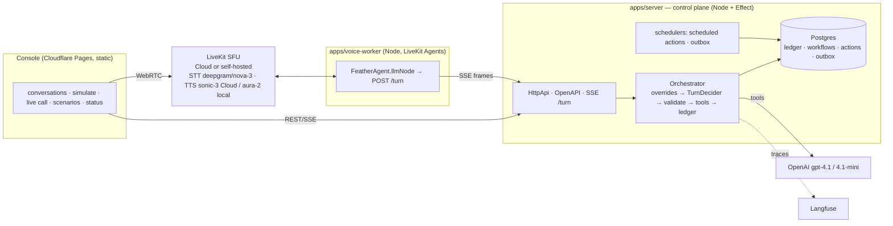

# Feather-Lite

A small **collections voice-agent platform** — the primitives a lender needs to run compliant
outbound calls at scale, not a chatbot with a phone number:

- a **deterministic state machine** that is the authority on what may happen on a call
  (right-party verification before any account data, tools legal only in specific states,
  compliance overrides that beat the model, promises recorded *before* they are confirmed aloud);
- an **LLM conversationalist** (GPT-4.1 / 4.1-mini per state) that only ever *suggests*
  transitions and tool calls — every suggestion is validated and, when illegal, rejected and logged;
- a **durable event ledger** in Postgres (monotonic `sequence_no` per conversation) that the
  transcript, the outcome, the replay view, scheduled follow-ups and post-call jobs are all
  derived from — so a JSON simulation, the scenario suite and a real LiveKit voice call
  produce identical events for identical inputs.

Built as an interview artifact for a Backend + AI Engineer role at a lending voice-agent company;
the PRD (`PRD.md`) and implementation spec (`SPEC.md`) are the requirements, this repository is v2:
**TypeScript + Effect** end to end (control plane, LiveKit Agents worker, browser console). A Python
v1 came first and was rewritten after the review in `docs/reviews/`; it is gone from the tree (ADR
0005 records why TypeScript won) and lives on only in git history.

## What is here (v2, verified 2026-08-21)

| Area | Status | Evidence |
|---|---|---|
| Pure domain (`packages/domain`): states, adjacency, overrides, tool matrix, event union, replay reducer, pre-call policy, scripts | done | 92 unit tests |
| Control plane (`packages/control-plane`): Effect services, Postgres via `@effect/sql-pg`, three-phase turn, tools with idempotency, scheduled-action + outbox workers, scripted + OpenAI deciders, Langfuse tracing | done | 27 unit + 28 DB tests, incl. **20/20 scenarios** on real Postgres |
| HTTP API (`packages/contracts` + `apps/server`): Effect HttpApi, 18 routes, OpenAPI at `/docs`, SSE turn stream, bearer/rate-limit middleware | done | live smoke: start / turn(SSE) / replay / 409 / 422 / scenarios |
| Voice worker (`apps/voice-worker`): LiveKit Agents 1.6 `llmNode` → `/turn`, barge-in heard-text, interruptible read-back guard, AMD-gated SIP path, heartbeats | done (browser path) | automated real voice call on LiveKit Cloud with GPT-4.1; scripted voice call == simulation scenario (state path, tools, outcome) |
| Operator console (`apps/console`): conversations, transcript + timeline + replay, simulate (streaming), **call me in the browser**, scenario matrix, status/seed | done | headless run: 20/20 matrix, PTP simulation, browser call joined LiveKit Cloud with live transcript |
| Deployment on free tiers (Neon + Cloudflare Tunnel + Pages + LiveKit Build) | documented, needs your accounts | `docs/deploy/free-tier-live-demo.md` |
| **Self-hosted media plane**: LiveKit SFU in Docker (`pnpm lk:up`), Deepgram direct plugins (nova-3 STT + Aura TTS) behind `STT_TTS_PROVIDER` | done | headless voice call + browser call on the local SFU, both equivalence-green vs the simulation; ADR 0006 |
| **Load tested**: control plane to 200 concurrent conversations, voice fleet to 5 concurrent real calls (10 = CPU ceiling) | done | 200/200 correct outcomes at C=200, 5/5 equivalence-green at N=5; `docs/loadtest/` |
| PSTN via SIP trunk, Oracle always-on VM, latency waterfall panel, chaos (kill worker mid-call) test, Effect 4 | **not done** | listed honestly in "Not built" below |

Progress by phase: `docs/plans/PROGRESS.md`. Decisions: `docs/adr/`. Review that led to v2:
`docs/reviews/2026-08-16-plan-vs-implementation-review.md`.

## Architecture



- **The control plane owns the loop** (ADR 0001). The worker is a media adapter: it sends the
  borrower's final text (and, after a barge-in, the *heard* part of the agent's last line) and
  speaks the frames it gets back (ADR 0002).
- **A turn is three phases** — claim (tx) → decide (no tx) → commit (tx) → speak (ADR 0003).
  Read-backs and "recorded" confirmations are only spoken after the commit.
- **Everything is a Layer.** `TurnDecider` is scripted in tests/CI and OpenAI in production;
  `Tracing` is Langfuse or noop; the `Clock` is frozen for scenario replays and shifted for
  seeded history — same orchestrator, no mocks.

### The turn frame protocol (`packages/contracts/src/turnFrames.ts`)

`turn_start{turn_id,state}` → `delta{text}`* → `say{text,allow_interruptions}`* →
`turn_end{new_state, agent_text, tool_called, call_control_action, outcome, end_call, degraded, ttft_ms}` | `error{code,message}`

Same stream for the console (`Simulate`) and the voice worker; `turn_id` idempotency and
`supersede` (barge-in) are handled server-side.

### Repository map

```
packages/domain/         pure: enums, ids, values, stateMachine, overrides, tools, events, replay, transcript, preCall, context, scripts, turn
packages/contracts/      HttpApi definition (18 routes) + SSE turn frames
packages/control-plane/  config, db (migrations, repos), services (Orchestrator, Workflow, Scheduling, Outbox, Scenarios, Seed, VoiceSessions, Tracing, VirtualClock), llm (LlmClient, prompts, OpenAITurnDecider), http (handlers, TurnRunner, app)
apps/server/             Node entry: API + in-process schedulers
apps/voice-worker/       LiveKit Agents worker (+ tracer/ harnesses: fake borrower, fleet, equivalence, lk-smoke, text-run)
apps/console/            Vite + TS operator console (no framework), deploys to Pages
apps/load-test/          tier-1 control-plane load harness (plain tsx)
deploy/livekit/          livekit-server config for the self-hosted compose profile
docs/adr/                0001–0006 · docs/deploy/ runbook · docs/loadtest/ results · docs/plans/ plan, revisions, findings, progress
```

## Run it locally

Prerequisites: Node 22, pnpm 11, Docker (for Postgres). Copy `.env.example` to `.env`.

```bash
pnpm install
pnpm db:up                       # Postgres 16 on localhost:5434
pnpm dev:server                  # API on http://127.0.0.1:8080  (migrations run on boot; /docs = OpenAPI)
curl -X POST http://127.0.0.1:8080/api/demo/seed
pnpm dev:console                 # console on http://127.0.0.1:5173 (proxies /api to 8080)
```

That is enough for **Conversations**, **Simulate** (streaming JSON path) and **Scenarios** with the
deterministic decider. For the real model set `TURN_DECIDER=openai` + `OPENAI_API_KEY` in `.env`
(and Langfuse keys if you want traces). For **Live call** add the LiveKit Cloud keys and start the
worker:

```bash
pnpm dev:worker                  # LiveKit Agents worker "feather-lite-agent" (heartbeats show on Status)
```

`pnpm dev` runs server + worker + console together.

### Voice with no cloud account (self-hosted LiveKit)

The media server is a config value, not an architecture decision (ADR 0006). To run the whole stack
locally, start the SFU and point `.env` at it:

```bash
pnpm lk:up                       # livekit-server in Docker: ws://127.0.0.1:7880 (+ UDP 7882 mux, TCP 7881)
```

```
LIVEKIT_URL=ws://127.0.0.1:7880
LIVEKIT_API_KEY=devkey
LIVEKIT_API_SECRET=<deploy/livekit/livekit.yaml keys.devkey>
STT_TTS_PROVIDER=plugins         # LiveKit Inference is Cloud-only; use Deepgram directly (nova-3 STT + Aura TTS)
DEEPGRAM_API_KEY=...
```

Nothing else changes — the server, console and tracers work against either target. Going back to
Cloud is the same four lines in reverse. SIP/PSTN stays Cloud-only (no `livekit-sip` locally); the
worker fails such a call fast with a clear log line. Smoke the server with
`pnpm --filter @feather-lite/voice-worker lk-smoke`.

### Tests

```bash
pnpm check                       # typecheck + unit tests (domain 92, control-plane 27)
pnpm test:db                     # 28 DB tests on Postgres: 20 scenarios, repos, concurrency, workers, LLM leak
pnpm --filter @feather-lite/voice-worker text-run      # LiveKit text-mode harness against the fake control plane
pnpm --filter @feather-lite/voice-worker fake-borrower # automated real voice call + SPEC §10.5 equivalence assertion
pnpm loadtest:tier1 -- --concurrency 100 --ramp 2      # control-plane load: 100 concurrent conversations
pnpm loadtest:tier2 -- --calls 5                       # voice load: 5 concurrent real calls, each equivalence-checked
```

CI (`.github/workflows/ci.yml`) runs typecheck, unit tests and the DB suite against a Postgres
service container. Both load harnesses gate on **correctness** — every conversation's final ledger
must replay to the expected scripted outcome — and merely report latency. Measured numbers and the
saturation analysis are in **`docs/loadtest/README.md`**.

## Live, free, clickable demo

`docs/deploy/free-tier-live-demo.md` is the runbook: Neon (Postgres), Cloudflare Tunnel (API URL),
Cloudflare Pages (console), LiveKit Cloud Build (media), Deepgram + Cartesia (STT/TTS), optional
Langfuse — total $0 plus cents of OpenAI. `pnpm tunnel` and `pnpm deploy:console` are wired; the
console takes the API URL and bearer token from `?api=…#token=…`.

## Not built (deliberately listed)

- **PSTN dial-out** is wired (`createSipParticipant` + AMD → `amd_result` signal) but no SIP trunk
  was configured, so it is not verified end to end.
- **Always-on hosting** (Oracle Always Free VM) is documented, not exercised; the API is up while
  the Node processes run.
- **Horizontal scale** is untested. Load testing found the knee at ~70–85 turns/s on one Node
  process and showed Postgres was nowhere near saturated (raising the pool made it slower); a second
  server process is the obvious next lever, and it has not been run.
- **Latency waterfall** in the console (EOT → decision TTFT → first audio): `ttft_ms` is on every
  `turn_end` frame and stored per turn (`conversation_turns.result`); the panel is not built.
- **Chaos test** (kill the worker mid-call and prove the ledger resumes): the design supports it
  (`active_turn_id`, idempotent turns); no automated test.
- Semantic (embedding) override safety net, LLM-as-judge evaluation, Durable Objects/Queues,
  Effect 4 — stretch items from the plan.
