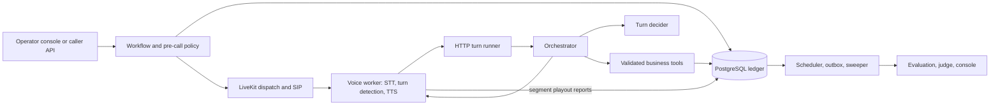

# Feather-Lite pilot readiness and remaining work

Date: 2026-10-04. Target: a limited pilot with real borrowers and telephone calls in the United States, collecting for another lender. Human handling remains undecided; both staffed follow-up and immediate transfer are assessed below.

Subsequent scope decision, 2026-10-04: the user selected staffed follow-up and a first milestone of a working local Docker product for demonstrations, with hosted AI services allowed. See [local product scope and Clef assessment](2026-10-04-local-product-scope-and-clef-assessment.md). The findings below retain their original pilot scope; statements that the human-handling choice is unresolved are historical.

## Assessment

**The repository contains a substantial working voice-agent prototype, but it is not ready for this pilot. Keep its core architecture. The next milestone should be a controlled, operable collection workflow with verified telephone delivery and human ownership.** The unfinished conversational research is real, but it is not the most urgent work.

The strongest implemented feature is the coordination of a proposed business action, durable transactions, and the exact speech segment that must be played before recording that action. The largest gaps sit around that core: authorization, collection eligibility, disclosures, lender data, telephone callbacks, human handoff, and recovery evidence. Several are concrete implementation defects, not merely enterprise features that might be useful later.

This review distinguishes:

- **Implemented:** present on the current code path; this alone does not establish live reliability.
- **Reproduced locally:** exercised during this audit without providers or a database.
- **Historical evidence:** saved runs, not newly reproduced measurements.
- **Source finding:** a demonstrable code mismatch whose full integration impact still needs a runtime test.
- **Pilot requirement:** additional work derived from the clarified operating target, beyond the prototype's original scope.

Snapshot: HEAD `4968c86430b1c6987a698a4352e356d47dd2f2b5`, with pre-existing working-tree changes in repository setup, CI, dependencies, and agent instructions. No tracked product changes were present under `packages`, `apps`, `deploy`, `patches`, or `docker-compose.yml` at the final source check. Setup files changed during the audit; the commands actually executed are recorded below. This review changes no application code.

## What the system actually does

The current implementation is TypeScript and Effect, with seven application/package workspaces. The old Python-oriented specification is historical. LiveKit Agents is pinned and patched at `1.6.4`; the local SFU image is `v1.13.5`. The worker supports configured speech backends; the default plugin path uses Deepgram STT and TTS. This is a turn-based agent with deterministic orchestration and a separate optional post-call judge.

1. `Workflow` selects the account/contact, checks the existing pre-call rules, and creates the workflow, attempt, conversation, and opening events.
2. `VoiceSessions` dispatches a worker; browser sessions and initial outbound SIP calls have paths. This is not evidence of an implemented inbound telephone product.
3. The worker manages speech, interruption behavior, its silence clock, admission, and playout reports. Its `llmNode` delegates the business decision to the control plane.
4. The orchestrator claims a turn in a short transaction, calls the model outside the transaction, then reacquires ownership and validates/commits the result. Supersession prevents an obsolete turn from committing a new result.
5. Business tools enforce allowed states and schemas. Protected account context is withheld until the right-party flag is set. That flag is based on conversational confirmation; it is not strong identity authentication.
6. A promise proposal stores the amount/date and a named read-back segment. The voice path requires a report of nonempty, uninterrupted playout for that segment before recording the stored proposal. Deterministic tool confirmations are spoken after commit. Ordinary model text can stream before the final transaction; “everything is committed before any speech” would be inaccurate.
7. Finalization records an outcome and creates durable follow-up/outbox work. The scheduler uses database claims; the sweeper combines heartbeat staleness with media-plane presence checks. Evaluation, summaries, scores, and optional judging feed the console.

Key implementation: [Workflow](../../packages/control-plane/src/services/Workflow.ts), [Orchestrator](../../packages/control-plane/src/services/Orchestrator.ts), [ToolExecutor](../../packages/control-plane/src/services/ToolExecutor.ts), [TurnRunner](../../packages/control-plane/src/http/TurnRunner.ts), [FeatherAgent](../../apps/voice-worker/src/feather-agent.ts), [SegmentLedger](../../apps/voice-worker/src/segment-ledger.ts).

## Capability inventory

| Area | Current implementation | Boundary or remaining work |
| --- | --- | --- |
| Domain model | State graph, schemas, override rules, replay, disclosure scripts, pre-call checks | Some policy rules and model-exposed transitions are incorrect or insufficient for the pilot |
| Transactions | Turn ownership, supersession, proposal/read-back guard, event ledger, idempotent operations | Crash/reconnect behavior needs stronger evidence and a stranded-turn fix |
| Voice | Browser audio, initial SIP dial path, STT/TTS, interruption controls, wait/held/resume behavior | Scheduled SIP metadata defect; real PSTN validation; unfinished natural turn-taking |
| Memory/context | Protected-context filtering, bounded call context, prior-call information | No need to add a vector database to make this pilot work; vector-index job is a stub |
| Scheduling | Durable callback/retry actions, claims and reclamation | Wrong callback dispatch metadata, policy gaps, external dispatch reconciliation |
| Humans | Escalation events and scheduled human-follow-up records | Transfer is explicitly stubbed; no delivered, acknowledged human work queue |
| CRM | Local borrower/contact/loan tables and tool writes | No established lender system-of-record synchronization or payment/status reconciliation |
| Quality | Deterministic evaluator, persisted scores, optional judge, human labels, dashboards | Evaluation timing race, mixed SLO populations, incomplete calibration and acceptance gates |
| Operations | Health/readiness, process metrics, Prometheus, tracing, Dockerfiles, CI, admission, sweeper | Access controls, pilot deployment profile, backup/restore, alert ownership, recovery drills |
| Console | Live call, simulation, scenarios, transcript/events, latency/quality/status and human verdicts | An engineering console, not a staffed collections case-management workflow |
| Scale | Scripted load harness and synthetic voice fleet; bounded resources | Historical local measurements do not establish production concurrency or multi-instance safety |

## Findings that block the pilot

### P01 — Borrower reads are unauthenticated and the reset route remains destructive

**Source finding.** `securityMiddleware` treats every GET as open, even when a bearer token is configured. Borrower-directory and conversation routes expose names, phone numbers, balances, transcripts, and events. Writes have only an optional shared token. CORS accepts all origins.

There is a separate concrete defect: the demo handler invokes `seed.reset()` without checking `demoMode`. That function truncates borrower, loan, workflow, conversation, event, score, and job tables. Only the load-fixture route checks the flag. Therefore setting `DEMO_MODE=false` does not disable seed/reset. The supplied Compose server environment also does not pass through `DEMO_MODE`.

**Required:** authenticate and authorize data reads and mutations; distinguish operator and worker access; remove or hard-disable destructive/demo/testing capabilities in a pilot profile; fail startup on unsafe pilot configuration. A single-lender pilot can use a small role model without implementing a general multitenant platform.

**Acceptance:** anonymous reads fail; unauthorized identities cannot read or mutate a conversation; a pilot deployment cannot invoke reset/seed/fixtures/scenario mutation; worker credentials grant only required operations; secrets and network exposure are checked against the actual deployment.

Evidence: [app.ts](../../packages/control-plane/src/http/app.ts) lines 61–74, [handlers.ts](../../packages/control-plane/src/http/handlers.ts) lines 426–443, [Seed.ts](../../packages/control-plane/src/services/Seed.ts) lines 178–181, [config.ts](../../packages/control-plane/src/config.ts), [Compose](../../docker-compose.yml).

### P02 — Collection eligibility is too narrow for US third-party collection

**Source finding plus pilot requirement.** Existing policy checks include an 08:00–21:00 local window, a seven-attempt threshold, invalid/opted-out contacts, deceased/opted-out borrowers, and active-call conflicts. `UNKNOWN` consent is allowed. Attempt counting is borrower-plus-contact-point, not person-plus-particular-debt across telephone numbers. There is no corresponding seven-day restriction after a telephone conversation. A new workflow can be started after an escalated/disputed outcome because those outcomes are not a durable account-level eligibility hold.

Regulation F's call-frequency presumptions address both attempts and conversations, are scoped to a person and particular debt, and have exclusions. Seven calls is not a blanket guarantee of compliance. [CFPB §1006.14](https://www.consumerfinance.gov/rules-policy/regulations/1006/14/). Rules also address inconvenient times/places, represented consumers, and communications with third parties. [CFPB §1006.6](https://www.consumerfinance.gov/rules-policy/regulations/1006/6/).

AI-generated voice falls within the FCC's artificial/prerecorded-voice framework; applicable consent or exemption must be established rather than inferred from a stored phone number. [FCC 24-17](https://docs.fcc.gov/public/attachments/FCC-24-17A1.pdf).

**Required:** a lender- and counsel-approved eligibility policy for the selected states, debt classes, contact methods, consent basis, restrictions, revocations, disputes, representation, and suppression scope. Persist the facts and decision reason. Apply it again immediately before a scheduled call is actually dispatched, including attempts made outside this application. These are engineering requirements to operationalize an approved policy, not a legal certification by this review.

**Acceptance:** table-driven policy cases covering multi-number/multi-debt histories, recent conversations, consent revocation, time zones/DST, inconvenient times, disputes/representation, and changed eligibility between scheduling and dispatch. A rejected call creates no telephone leg.

Evidence: [preCall.ts](../../packages/domain/src/preCall.ts), [attempt counting](../../packages/control-plane/src/repos/conversation.ts), [Workflow](../../packages/control-plane/src/services/Workflow.ts), [Scheduling](../../packages/control-plane/src/services/Scheduling.ts).

### P03 — Opening and voicemail policy need redesign before real borrowers

**Source finding plus pilot requirement.** `openingScript` speaks the debt-collection disclosure and recording line before asking for the named person. The worker plays that opening before processing the recipient's answer. The default company name includes “Collections,” including in voicemail copy. The protected account-context gate does not prevent this initial disclosure of collection purpose to whoever answers.

This follows the prototype's own script, and the deterministic evaluator rewards the initial mini-Miranda ordering. Passing that test is therefore not evidence that the real pilot's disclosure sequence is acceptable. Third-party communication restrictions require an approved recipient-verification and disclosure design. [CFPB §1006.6](https://www.consumerfinance.gov/rules-policy/regulations/1006/6/).

**Required:** approve the identification, disclosure, recording, wrong-party, and voicemail flows for the chosen cohort; implement that order in deterministic code and tests. Decide what verification is sufficient before revealing account details. Avoid adding invasive identity collection without a defined need.

**Acceptance:** wrong person, shared phone, voicemail, silence, uncertain identity, and interrupted opening produce only approved speech. The evaluator tests the revised policy, not the historical script. Select an actual monitored callback number; the default is a demo number.

Evidence: [scripts.ts](../../packages/domain/src/scripts.ts) lines 10–24, [FeatherAgent](../../apps/voice-worker/src/feather-agent.ts), [evaluation.ts](../../packages/domain/src/evaluation.ts), [config.ts](../../packages/control-plane/src/config.ts).

### P04 — Scheduled SIP callbacks and retries lack the destination number

**High-confidence source defect; no live call attempted.** Initial `VoiceSessions` metadata includes `contact_point_value`. Scheduled dispatch metadata in `Scheduling.prepare` does not. The worker explicitly refuses SIP jobs without that value or a trunk, signalling `sip_not_configured`.

Consequently, successful initial SIP setup would not prove the callback/retry path works. Existing SIP-redial coverage addresses unavailable configuration and other modes, not a successful configured-trunk callback through the worker.

**Required:** resolve and validate the contact at dispatch, supply the correct destination, and reconcile provider call identity/status with the durable attempt. Test duplicates and the crash window between provider acceptance and recording dispatch success.

**Acceptance:** an initial call and a scheduled callback both reach a controlled test phone through the intended trunk; no-answer, busy, rejection, timeout, cancellation, and duplicate dispatch resolve to correct durable outcomes without duplicate calls.

Evidence: [Scheduling.ts](../../packages/control-plane/src/services/Scheduling.ts) around line 159, [VoiceSessions.ts](../../packages/control-plane/src/services/VoiceSessions.ts) lines 61–67, [agent.ts](../../apps/voice-worker/src/agent.ts) lines 162–169 and 324, [sipRedial.test.ts](../../packages/control-plane/test/db/sipRedial.test.ts).

### P05 — Human handoff is recorded as complete without reaching a human

**Source finding.** `CallControl.warmTransfer` immediately writes `TRANSFER_COMPLETED` with `status: "handoff_stubbed"`. `Scheduling` marks `HUMAN_FOLLOWUP` done with `handled: "queued_for_human"` without delivering it to a staff queue. The conversational path speaks transfer-hold copy and finalizes the AI call.

There are two viable pilot designs. This is an unresolved product/operating decision, not permission to silently choose one:

| Option | Work required | Meaning of success |
| --- | --- | --- |
| Staffed follow-up | Durable case, queue/team ownership, reason and safe context, due time, acknowledgment, retries/dead letter, overdue alerts, and truthful callback copy | A human team has accepted responsibility within an agreed SLA; the borrower was not told they were being transferred immediately |
| Immediate transfer | Real telephone bridge/transfer, availability routing, pending/accepted/failed/no-answer states, controlled context sharing, and fallback when unavailable | The borrower is connected to the intended human; completed is emitted only after provider evidence |

For disputes and hardship, choose escalation/suppression behavior independently of whether a human is immediately available. A queue can be a smaller pilot implementation if the lender accepts the workflow and staffs it; a database row marked done is insufficient.

Evidence: [CallControl.ts](../../packages/control-plane/src/services/CallControl.ts) lines 43–76, [Scheduling.ts](../../packages/control-plane/src/services/Scheduling.ts) lines 114–117, [Orchestrator.ts](../../packages/control-plane/src/services/Orchestrator.ts) lines 419–428.

### P06 — Ordinary callback language triggers borrower-wide opt-out

**Reproduced locally.** The opt-out regex matches `call me again` without requiring a negative construction.

| Input | Actual classification |
| --- | --- |
| `Please call me again tomorrow` | `OPT_OUT` |
| `Can you call me again next week?` | `OPT_OUT` |
| `Do not call me again` | `OPT_OUT` |
| `I have no hardship, I can pay` | `HARDSHIP` |

The first two can invoke the real opt-out tool with borrower scope, suppressing future contact instead of scheduling it. Keyword-based overrides also ignore negation in other classes.

**Required:** correct the rules and add a contrastive utterance corpus covering negation, quoted speech, ambiguity, and ASR variants. Preserve prompt-independent handling of actual stop requests. This must precede expansion of the deterministic fast path.

**Acceptance:** actual opt-outs reliably suppress the approved scope; affirmative callback requests do not; ambiguous utterances take an approved clarification/escalation path.

Evidence: [overrides.ts](../../packages/domain/src/overrides.ts) line 96 and hardship rules; [Orchestrator](../../packages/control-plane/src/services/Orchestrator.ts).

### P07 — Model-exposed actions disagree with the state machine

**Locally reproduced transition rejection, with source-traced model path.** `request_human` is exposed in `CONFIRMING_OUTCOME` and proposes `WARM_TRANSFER_PENDING`, but that edge is absent. `end_call` is exposed in greeting, verification, and payment discussion, but normal transitions from those states to `ENDING` are also absent. The OpenAI adapter translates these pseudo-tools into suggested transitions; the orchestrator uses the normal transition validator and rejects them.

**Required:** reconcile the model action contract with domain legality. Ending or asking for a person must work in the approved states, including during read-back. Preserve the distinction between model actions and privileged runtime-forced transitions.

**Acceptance:** enumerate every exposed action in each state and exercise it through the decider/orchestrator boundary. A borrower can decline further conversation or request human handling without a rejected transition loop.

Evidence: [prompts.ts](../../packages/control-plane/src/llm/prompts.ts) lines 8–25, [stateMachine.ts](../../packages/domain/src/stateMachine.ts), [OpenAITurnDecider.ts](../../packages/control-plane/src/llm/OpenAITurnDecider.ts) line 116, [Orchestrator.ts](../../packages/control-plane/src/services/Orchestrator.ts) line 400.

### P08 — Date schemas permit past commitments and normalize impossible timestamps

**Reproduced locally.** A promise dated `2000-01-01` and a callback at `2000-01-01T12:00:00Z` pass tool validation. `2026-02-30T12:00:00Z` is accepted and becomes March 2. The timestamp decoder uses `Date.parse` without calendar round-trip validation. Tool execution has no corresponding future-date/business-horizon rule.

Past dates passing a structural schema is not by itself a schema design error; their acceptance by the business workflow is the missing policy. Silently changing an impossible calendar date is a separate validation defect. Positive money validation likewise does not specify the lender's allowed amount or negotiation policy.

**Required:** strict calendar validation plus execution-time date/timezone, horizon, and amount rules approved for the pilot. Resolve relative dates against the borrower's local calendar and read back unambiguous values.

**Acceptance:** reject impossible dates, disallowed past dates and amounts; cover leap years, DST, midnight and changed dates between proposal and confirmation; never schedule an immediate call merely because an invalid/past timestamp slipped through.

Evidence: [values.ts](../../packages/domain/src/values.ts) lines 20–45, [tools.ts](../../packages/domain/src/tools.ts), [ToolExecutor](../../packages/control-plane/src/services/ToolExecutor.ts).

### P09 — Conversation context can switch to a different loan

**Source finding; database reproduction still required.** `contextForConversation` joins the workflow but chooses the borrower's highest-priority loan using a lateral query, rather than joining `w.loan_id`. With multiple loans or a changing delinquency ordering, the spoken balance/date and subsequent promise update can refer to a different loan from the workflow.

**Required:** bind context and mutations to the workflow's durable loan identity, and reject inconsistent ownership. Keep explicit loan selection at workflow creation.

**Acceptance:** create two loans, start a workflow for one, rerank them, and prove all subsequent context/tool writes remain attached to the selected loan.

Evidence: [conversation.ts](../../packages/control-plane/src/repos/conversation.ts) lines 106–137; [ToolExecutor](../../packages/control-plane/src/services/ToolExecutor.ts).

### P10 — The lender and operator loops are not closed

**Pilot requirement grounded in current scope.** Local CRM records and outcome writes exist. There is no established inbound lender feed, payment reconciliation, acknowledged outcome export, or staffed exception workflow. “Promise recorded” is not “payment received”; the console's due/overdue view cannot determine fulfillment without payment data.

**Required:** choose the lender system of record and a small explicit contract for account identity, balance/status freshness, consent/suppression, withdrawals/payments, and returned outcomes. The first integration may be a controlled import/export process if that process meets the agreed freshness and ownership requirements. It still needs durable acknowledgment, idempotency, reconciliation, and a stop rule for stale information.

**Acceptance:** a paid, withdrawn, disputed, or revoked account cannot be called from a stale queue; outcomes reach the owning system once; failures become visible owned work. Payment processing itself can remain outside this pilot.

Evidence: [CRM repository](../../packages/control-plane/src/repos/crm.ts), [ToolExecutor](../../packages/control-plane/src/services/ToolExecutor.ts), [Outbox](../../packages/control-plane/src/services/Outbox.ts), [console quality](../../apps/console/src/views/quality.ts).

## Reliability and measurement work required before admitting borrowers

### R01 — Recover stranded turns and reconcile external effects

The architecture already has useful recovery mechanisms: graceful claim release, turn supersession, durable scheduled/outbox leases, retry limits, and voice-orphan detection. Their scope needs to remain explicit.

On a failure after turn start, `TurnRunner.finish` removes the turn from the in-memory `claimed` map without releasing its database claim. A transaction failure before normal T2 release can therefore leave a slot that the shutdown cleanup no longer knows about. A hard process kill also bypasses in-memory finalizers. This is a source-derived failure path, not a reproduced database incident in this audit.

After memory retention/restart, durable turn replay does not reconstruct the entire original speech stream. Provider dispatch is also an external effect separated from its database record. Neither exactly-once telephone dialing nor seamless mid-sentence resume follows from database idempotency alone.

Before pilot: add bounded ownership recovery/fencing where needed, define safe reconnect behavior, and exercise server kill, worker kill, DB failure, STT/TTS failure, media outage, duplicate dispatch, late playout, and stale callbacks. Assert both durable state and what the recipient hears. Do not automatically redial an uncertain external dispatch.

Evidence: [TurnRunner.ts](../../packages/control-plane/src/http/TurnRunner.ts) lines 65–90 and 136–180, [Orchestrator](../../packages/control-plane/src/services/Orchestrator.ts), [Sweeper](../../packages/control-plane/src/services/Sweeper.ts), [Scheduling](../../packages/control-plane/src/services/Scheduling.ts).

### R02 — Evaluate a completed media record, not only a committed outcome

`CallFinalizer` enqueues jobs at outcome commit. The orchestrator then emits final speech; playout and timing reports can arrive later. `Outbox.processJob` reads the event snapshot once and assumes post-call means complete. An evaluator or judge can therefore observe an incomplete closing transcript or latency record. This is a scheduling race identified in source.

Add an explicit media-complete/barrier or a bounded completion-and-revision protocol. Test delayed final playout and late metrics. Scores must identify the transcript/event revision they judge; incomplete evidence must be visible rather than silently treated as a pass.

Evidence: [CallFinalizer.ts](../../packages/control-plane/src/services/CallFinalizer.ts) line 71, [Outbox.ts](../../packages/control-plane/src/services/Outbox.ts) around lines 61 and 120, [Orchestrator](../../packages/control-plane/src/services/Orchestrator.ts).

### R03 — Make latency and quality verdicts represent the intended calls

- The latency waterfall adds EOU delay and transcription delay. In the installed `1.6.4` SDK, both are measured relative to the last speaking time; they overlap. Their sum is not a clean end-to-end measurement. Use a defined borrower-audio-end to first-agent-audio measurement for the pilot SLO, keeping overlapping components as diagnostic measurements.
- `Quality.sloStatus` has a voice/model/harness-aware population, but the general `Quality.report` feeds a mixed window to the console. Tier-3 also fetches that general report. A note saying harness calls are excluded does not change the query it uses.
- The fleet exit gate checks business-path equivalence, WER, and amount errors. It does not enforce all reported latency/compliance measures. Tier-3 verdicts are based on scenario assertions and can return zero for expected failures.
- The read-back scenario's saved success does not establish that an early “yes” was retained: recorded dispositions were all `respond`, and eventual success can use later confirmation.
- `resources.ts` discovers running containers as `present` but still passes the original container list to `docker stats`. Missing names can invalidate a resource sample.

Required: consistent cohort/run IDs, complete denominators and missing-data status, critical entity/state/action assertions, true audio-boundary latency, and release gates whose exit status matches their advertised claim. Preserve expected-failure scenarios as development diagnostics, but exclude them from the required-passing pilot suite.

Evidence: [Queries.ts](../../packages/control-plane/src/services/Queries.ts) lines 241 and 353, [Quality.ts](../../packages/control-plane/src/services/Quality.ts) lines 203–222 and 294–295, [fleet](../../apps/voice-worker/src/tracer/fake-borrower-fleet.ts), [Tier-3](../../apps/voice-worker/src/tracer/sim-borrower.ts), [scenario definitions](../../apps/voice-worker/src/tracer/scenarios-tier3.ts), [resource sampler](../../apps/load-test/src/resources.ts) lines 499–501. The installed SDK source is `apps/voice-worker/node_modules/@livekit/agents/src/voice/audio_recognition.ts`, lines 132–133.

### R04 — Establish a deployable and supportable pilot configuration

The repository has Docker images, resource limits, readiness, admission, metrics, and CI definitions. It still needs a specific pilot environment with TLS/network policy, production credentials, protected database access, backup/restore verification, retention/access policy, alert delivery, and an operator who can stop new calls and deal with in-flight incidents. Redaction masks some account facts; it deliberately retains names and does not make transcripts anonymous.

Record immutable application, prompt/policy, model, speech configuration and dependency identities with runs/calls; the fixed bootstrap agent-version label does not provide that provenance. Set a conservative concurrency cap from measurements on the actual deployment. A single control-plane process can be a deliberate initial constraint; multi-process SSE, rate-limit/cap behavior, worker heartbeat identity, scheduler recovery and external-effect duplication need validation before scaling out.

A pilot deployment must pass a restore drill and a controlled stop/restart drill. Alert on missing/late human cases, stale data, rejected tools, unanswered turns, provider failures, orphaned calls, and growing job backlog. Judge quality and estimated cost are supporting signals, not substitutes for human review of the initial cohort.

Evidence: [Compose](../../docker-compose.yml), [server entrypoint](../../apps/server/src/main.ts), [CI](../../.github/workflows/ci.yml), [Tracing](../../packages/control-plane/src/services/Tracing.ts), [redaction](../../packages/domain/src/redact.ts), [Workflow](../../packages/control-plane/src/services/Workflow.ts).

## What remains from the original roadmap

The most useful continuation document is the [September 5 attribution and turn-taking specification](../plans/2026-09-05-attribution-contract-instruments-and-self-hosted-turn-taking-spec.md). The older [progress log](../plans/PROGRESS.md) is not current enough to use as a checklist.

| Plan area | Code/evidence status | Remaining work |
| --- | --- | --- |
| Phase 0: segment attribution | Implemented: segment IDs, ledger attribution, read-back protection; two saved N5 business-path gates pass | Preserve and extend under real telephone/recovery testing; do not rebuild as missing |
| Phase 1: instruments | EOT probability instrumentation and several vocabulary/resume attribution changes exist | Disposition/decider/speak-mode wire metadata; VAD/interruption diagnostics; missing escape-path counters; dedicated turn-taking/entity presentation |
| Phase 2: scenarios | Existing Tier-3 framework and four runnable scenario definitions | Mid-utterance pause, post-question pause, realistic seeded event mix, agent-backchannel measurement hook; strengthen assertions |
| Phase 3: deterministic fast path | No implemented `classifyIntent` path producing the planned fast-path behavior | Build only after correcting overrides; preserve model fallback and policy priority; measure precision and latency |
| Phase 4: silence by last agent act | Current hold-kind clock exists | Implement the planned act-specific silence policy after choosing the intended borrower experience |
| Phase 5: platform experiments | Pinned SDK 1.6.4 and SFU 1.13.5 remain | Version-aware SDK/SFU upgrade, patch review, Smart Turn shadow evaluation, one Cloud comparison if justified |
| Phase 6: ADR and docs | ADRs stop at 0010 | ADR 0011 and reconciled progress/docs after decisions and measurements |
| Earlier D4 simulator expansion | Personas/audio degradation modules exist | Wire the third-party participant and accent/noise Tier-3 scenarios; their `needs` guards still refuse execution |
| Earlier D6 judge work | Judge verdicts and human labels implemented | Abstention/calibration design, representative human-labeled data and meaningful agreement analysis |
| Earlier efficiency work | Most measured optimization and observability work landed | Multi-server/recovery evidence and selected measured audio/provider experiments; retain rejected experiments as rejected |

Current LiveKit documentation distinguishes turn detection from interruption handling and describes options beyond this pinned setup. That does not establish compatibility with the private SDK seams used here; upgrades must review the installed source and patches, then rerun behavioral gates. [LiveKit turn handling](https://docs.livekit.io/agents/logic/turns/). The September plan's target versions are historical migration targets, not a recommendation to adopt them blindly today.

The previous research's rejections still matter: there is no demonstrated reason to rewrite the control plane in Go/Python, add a micro-turn LLM, replace the architecture with speech-to-speech, or add a vector store to finish this pilot. The rejected Flux/preemptive-generation/queue-size experiments should not be treated as unfinished obligations. More conversational fluidity is worth pursuing after correctness and operability have measurable gates.

GitHub was checked read-only: issues [1](https://github.com/Vaibtan/Feather-Lite/issues/1), [2](https://github.com/Vaibtan/Feather-Lite/issues/2), [4](https://github.com/Vaibtan/Feather-Lite/issues/4), and [5](https://github.com/Vaibtan/Feather-Lite/issues/5) were open; [3](https://github.com/Vaibtan/Feather-Lite/issues/3) was closed. Issue 4's recommendations had an affirmative owner response but the issue remained open. Issue state, approval comments, implemented code, and completed evidence are different facts. No issues were modified.

## Historical results and what they establish

| Saved run | Observed result | Interpretation |
| --- | --- | --- |
| [September 1 N10](../loadtest/2026-09-01-tier2-n10.json) | 10/10 business-path equivalence; 30 measured turns; audio turn latency p50 2,961 ms, p95 3,495 ms; zero unanswered; WER p95 0, maximum 0.1111 | Useful synthetic-path evidence. Not proof of 2.5-second p95, real borrower performance, or every event/argument being equivalent |
| [September 5 phase-0 A](../loadtest/2026-09-05-tier2-n5-phase0-gate-a.json) | 5/5 equivalence; 15 turns; p95 6,249 ms | Attribution/business behavior passed while a latency tail remained |
| [September 5 phase-0 B](../loadtest/2026-09-05-tier2-n5-phase0-gate-b.json) | 5/5 equivalence; 15 turns; p95 4,484 ms | Second correctness gate, not demonstrated SLO attainment |
| [Backchannel scenario](../loadtest/2026-09-05-tier3-backchannel-mid-line-resume-attributed.json) | Expected interruption failures recorded with zero exit code | A useful known-failure tripwire, not clean conversational behavior |
| [Early read-back confirmation](../loadtest/2026-09-05-tier3-yes-during-read-back-phase0-segment-attribution.json) | Final scenario assertions pass | Inspect exact timing/dispositions before claiming the early confirmation was accepted correctly |

There are also historical scripted-control-plane load reports. Scripted concurrency, synthetic WebRTC audio, and actual PSTN borrowers are different workloads. None should be relabeled as enterprise capacity or compliance certification.

## Recommended build sequence and exit criteria

### 1. Fix the bounded correctness defects

Address P01 and P04–P09: close/reset access, destination metadata, honest handoff states, override classification, pseudo-tool/state consistency, date/amount rules, and stable loan identity. Add regression tests that exercise the triggering behavior, including database/worker boundaries where relevant. Keep the segment read-back guard intact.

**Exit:** each reproduced defect has a regression test; all exposed actions and terminal paths are coherent; configured SIP callbacks are proven on controlled phones; no outcome claims an external action that has not happened.

### 2. Define and implement the pilot operating contract

Resolve P02, P03, P05 and P10 together: exact states/debt types, consent provenance, verification/disclosures, lender data freshness, exception routing, suppression, staffed queue versus transfer, SLA, and staff ownership. These decisions affect schemas, scripts, eligibility, and tests. Record them in one pilot specification.

**Exit:** a reviewed policy matrix and concrete lender/human contracts exist; the software enforces them before calling and while handling exceptions. The unresolved human option is explicitly selected.

### 3. Complete real telephone and failure-path validation

Use internal controlled numbers first. Exercise phone answer/no-answer/busy/voicemail/wrong-party, scheduled callbacks, speech/provider failures, disconnect during read-back, duplicate signals, restarts, and human-unavailable cases. Verify actual recipient audio and provider state alongside the ledger.

**Exit:** no incorrect commitment, disclosure, suppression, duplicate call, fabricated transfer, or lost required human case in the agreed acceptance corpus; unresolved external state results in a safe owned exception. Recovery has a demonstrated bound.

### 4. Repair instruments, then improve the measured voice experience

Address R02/R03 and the missing Phase 1/2 instruments/scenarios. Run a reproducible baseline with explicit cohort, provider/model configuration, cache policy, infrastructure and missing-data counts. Improve the dominant measured latency/turn-taking failures. Add the fast path or platform upgrade only when it improves the relevant measurements without degrading critical behavior.

**Exit:** quality gates fail when the protected behaviors fail; latency measures use defined audio boundaries; all required scenarios genuinely pass; human-reviewed examples cover accents, corrections, pauses, negation, interruption and distressed/confused borrowers. Sample size and thresholds must be agreed for the actual cohort, not inherited from an N5 smoke test.

### 5. Launch a capped, staffed pilot after operational rehearsal

Deploy the pilot profile, complete backup/restore and stop/restart exercises, establish alert ownership and case handling, and prove lender reconciliation. Begin with a small allowlisted cohort under a measured concurrency cap. Review initial calls and exceptions with humans, and expand only from observed performance.

**Exit:** named owners, calling restrictions, daily reconciliation, stop criteria and escalation SLA operate in practice. No live borrower calling is authorized or initiated by this audit.

## Decisions still needed

The user has already selected the pilot finish line, US jurisdiction and third-party collection role. Those do not need to be asked again. The next specification needs:

1. Participating lender, debt types and permitted states; the source and evidence of calling consent/eligibility.
2. Staffed follow-up versus immediate transfer, with hours, destination/team, SLA and unavailable behavior.
3. Lender source of truth, update cadence and outcome acknowledgment method.
4. Approved right-party, debt/AI/recording disclosure and voicemail flows, including the monitored return-call route.
5. Initial borrower cohort, calling volume/concurrency, deployment region and staff coverage.
6. Quality/latency thresholds and incident stop criteria, plus the human reviewer responsible for accepting evidence.

These are consequential design inputs. They do not prevent fixing the confirmed implementation defects or improving the test instruments first.

## Audit coverage and verification

The review inventoried all application/package source, tests, scripts, deployment/CI files and patches: 132 `src` TypeScript files and 83 test TypeScript files in the inventory. It traced the critical end-to-end paths and inspected the domain, contracts, orchestrator/tools, repositories/migrations, scheduler/outbox/sweeper, HTTP security and handlers, voice lifecycle/playout/interruption, console, harnesses, configuration, build/deploy setup, ADRs, research/specifications, issue state and saved evidence. Depth was greatest on borrower-facing state changes, external actions, speech truth and release gates. This is a repository-wide architecture/readiness review, not a claim that every line of every vendor dependency, generated bundle or historical report received a separate security audit. The counts describe coverage scope, not a test count.

Fresh checks completed during this audit:

| Check | Result |
| --- | --- |
| `pnpm check` | Passed: agent setup validation, workspace typechecks and unit suites |
| `pnpm lint` | Passed separately |
| `pnpm build` | Passed for server and worker, including bundle external checks |
| `pnpm console:build` | Passed |
| Direct pure-function probes | Reproduced override, date and state-transition findings above |
| Source/config/version verification | Installed LiveKit Agents reports 1.6.4; product source unchanged relative to HEAD; pre-existing setup edits preserved |
| DB integration and migration tests | Not rerun: Docker engine unavailable; DB suite has destructive reset behavior and no isolated DB was started |
| Container builds/boot, provider calls, SIP and fleet runs | Not rerun; historical files are labeled as historical |

At execution time `pnpm check` expanded to `pnpm validate:agents && pnpm typecheck && pnpm test`; lint was therefore run independently. The current CI defines DB tests and container boot checks, but inspecting those definitions is not evidence that a current remote CI run passed. No paid provider calls, borrower calls, infrastructure changes, external messages, commits, or issue updates were made.

The useful next implementation artifact is a pilot specification and a short ordered backlog derived from P01–P10/R01–R04, with the unresolved operating choices filled in. Completing the old conversational roadmap alone would leave the pilot blockers intact.
